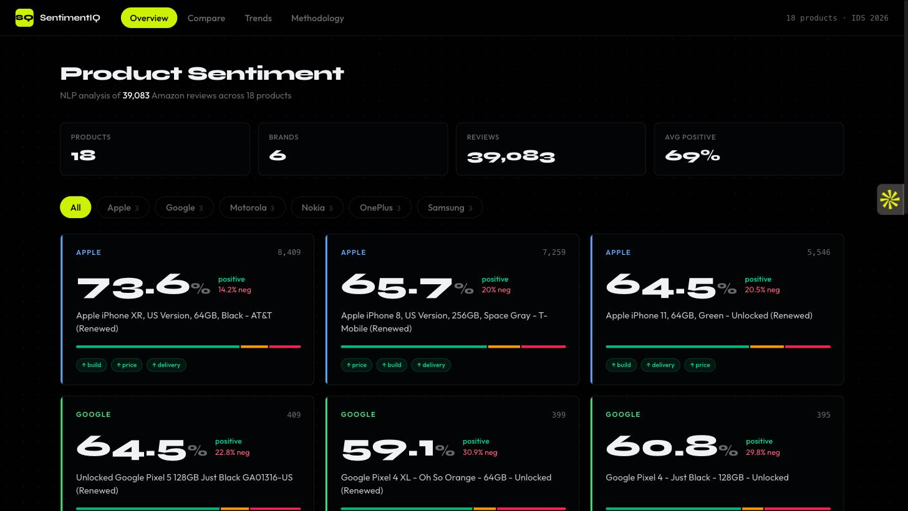

# Customer Sentiment Analysis Dashboard

An interactive dashboard that analyzes customer sentiment from Amazon Cell Phones & Accessories reviews using NLP, deployed as a static site on Vercel.

**Live demo:** [amazon-tracking-db-system-one.vercel.app](https://amazon-tracking-db-system-one.vercel.app)

---

## Preview



---

## What it does

- Classifies ~1M Amazon reviews as positive, neutral, or negative using VADER and TextBlob
- Extracts aspect-level sentiment (battery, camera, screen, price, build, delivery) per product
- Tracks how sentiment changes over time (monthly)
- Presents everything in a polished Next.js dashboard with brand filtering, product detail views, trend charts, and side-by-side product comparison

**Brands covered:** Apple, Samsung, Google Pixel, OnePlus, Motorola, Nokia (top 3 products each = 18 products total)

---

## Repo structure

```
/
├── pipeline/        # Python NLP pipeline (run once locally)
│   ├── 01_filter_data.py
│   ├── 02_sentiment.py
│   ├── 03_aspects.py
│   ├── 04_aggregate.py
│   ├── tests/
│   └── requirements.txt
├── app/             # Next.js 14 frontend (deployed to Vercel)
│   ├── app/
│   ├── components/
│   ├── data/        # data.json output from pipeline
│   └── vercel.json  # Vercel project config (root directory = app/)
└── docs/            # Project report and proposal
```

---

## Getting started

### 1. Download the dataset

Download the **Amazon Cell Phones & Accessories 5-core** dataset from the [McAuley Lab](https://cseweb.ucsd.edu/~jmcauley/datasets/amazon_v2/) and place the JSON file at `pipeline/data/raw_reviews.json`.

### 2. Run the Python pipeline

```bash
cd pipeline
pip install -r requirements.txt
python -m spacy download en_core_web_sm
python 01_filter_data.py
python 02_sentiment.py
python 03_aspects.py
python 04_aggregate.py
```

This writes `app/data/data.json`.

### 3. Run the Next.js app locally

```bash
cd app
npm install
npm run dev
```

Open [http://localhost:3000](http://localhost:3000).

---

## Deploying to Vercel

1. Push this repo to GitHub (already done).
2. Go to [vercel.com](https://vercel.com) → **Add New Project** → import this repository.
3. Set the project's **Root Directory** to `app` so Vercel picks up `app/vercel.json`.
4. Click **Deploy**. All future pushes to `main` trigger automatic redeploys.

Already deployed — see the **Live demo** link at the top of this file.

---

## Tech stack

| Layer | Technology |
|---|---|
| Sentiment analysis | VADER, TextBlob |
| Aspect extraction | spaCy |
| Frontend | Next.js 14, shadcn/ui, Recharts, Tailwind CSS |
| Deployment | Vercel |

---

## Team

Moiz Ali (024) · Ayesha Aleem (005) · Zainab Fatima (087)
Introduction to Data Science — BS(CS) 6A, Bahria University Karachi
